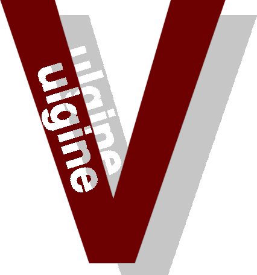

###### VULGINE

#### About Vulgine:
    Vulgine is designed to reduce amount of code to increse productivity of
    writing vulkan apps. It is easy to use, quick to setup and intuitive
    if you written "Hello triangle" and have some knowlege in Vulkan.
    If not here is some great material that I used: https://vulkan-tutorial.com

#### Setup:
    1. Check if you have vulkan on your computer (use "vkcube" in cmd to do it)
        and it doesn`t return any errors
    2. Just include "vulgine/vulgine.hpp" to your C++ file and have fun playing with it.
        (every function is in vg namespace)
    3. Check if you using at least C++ 17, otherwise it wouldn`t work becouse of std::optional

#### Changelog:
    
 